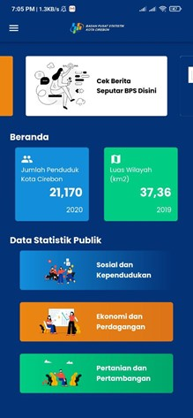
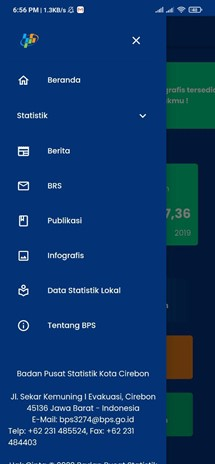
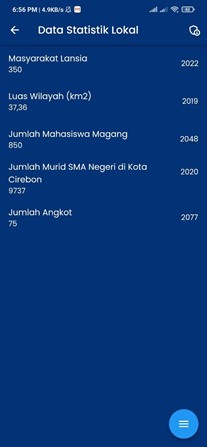
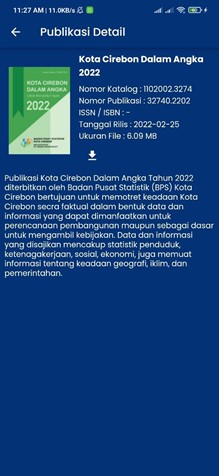

# cirebon_onstats

Cirebon OnStats is made with Flutter and Provider to show data from WebAPI BPS customized to fetch Kota Cirebon statistics data.

## Features
- See anything like in websites but in mobile apps such as Statistik, Berita, BRS, Publikasi & Infografis.
- Download PDF provided in Publikasi.
- Look local data in Data Statistik Lokal.
- Input data in data statistik lokal for Admin.

## Technologies

- Flutter
- Provider
- Firebase Cloud Firestore
- Dio
- Web API BPS - [Docs](https://webapi.bps.go.id/documentation/)

## Screenshots

